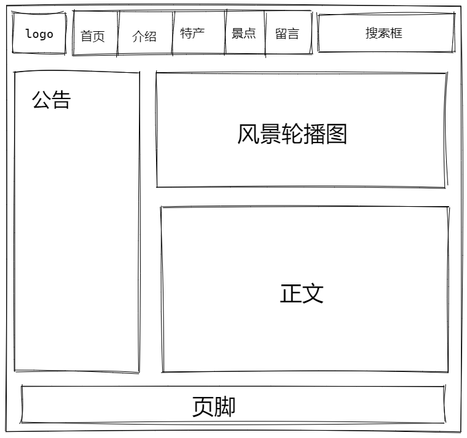

## 立项报告

**网站目标：** 介绍家乡温州。主要有基本介绍、特产、景点、详细介绍、留言界面。

**网站内容：** 从网络搜集关于温州的资料和图片。由轮播图和正文来进行描述。

**原型：**

## 第一阶段

**内容类型：** 家乡介绍、美食、特产、景点、留言

**家乡介绍：** 图片+多行文本

**美食：** 图片+多行文本+轮播效果

**特产：** 图片+多行文本

**景点：** 图片+多行文本

**留言：** 多个文本框表单+提交按钮

